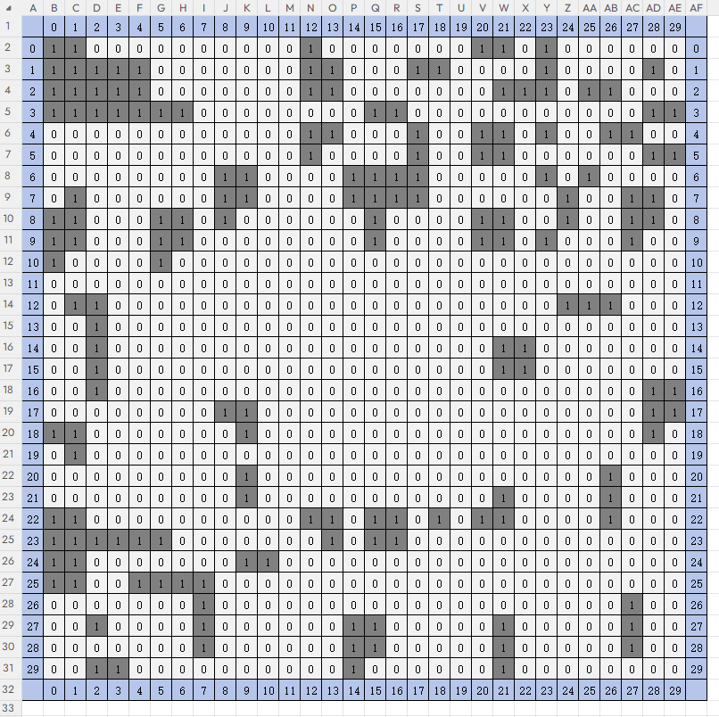
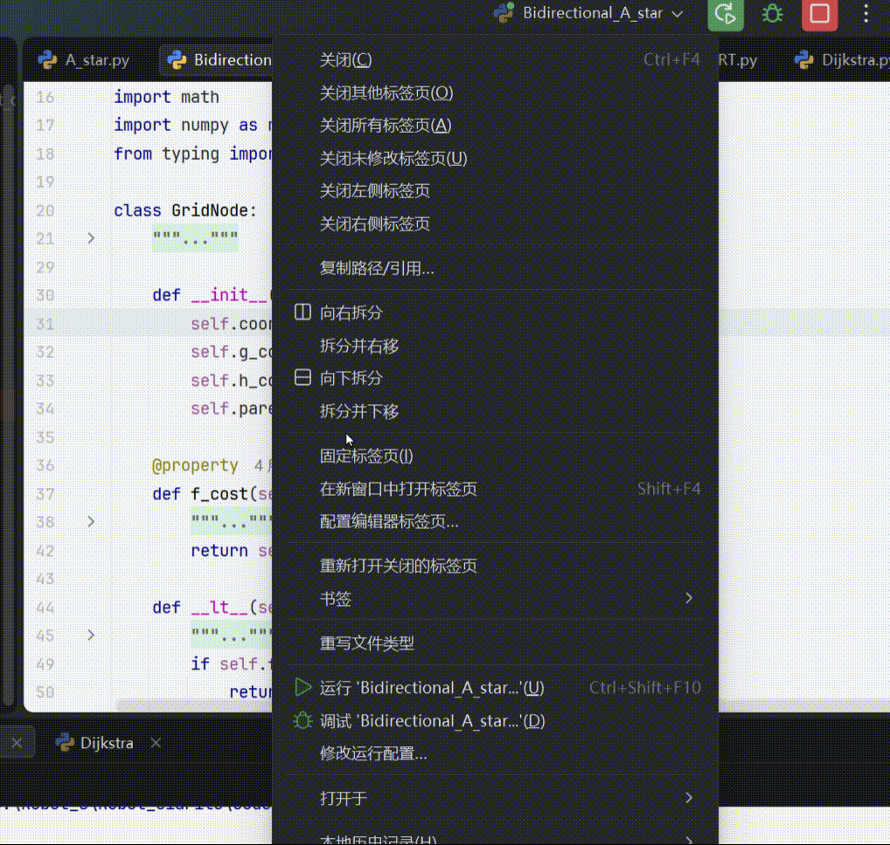
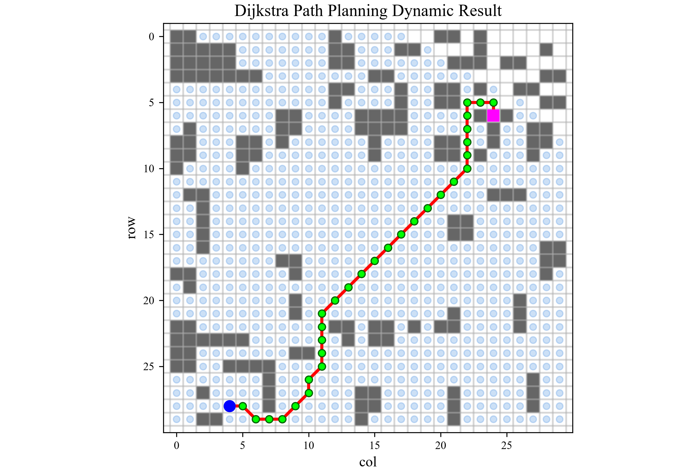
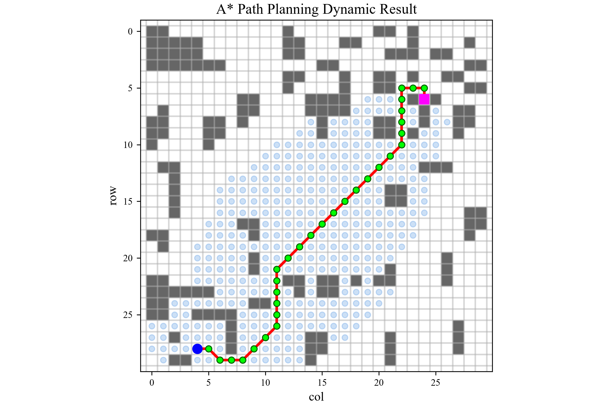
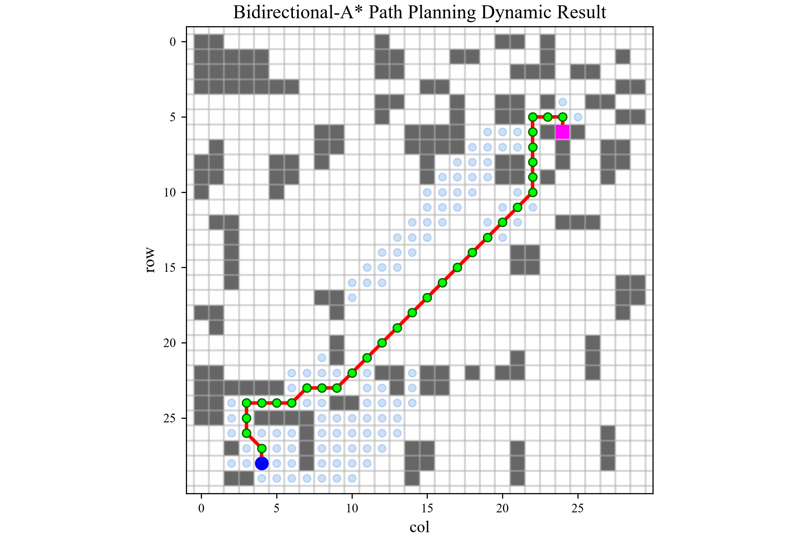
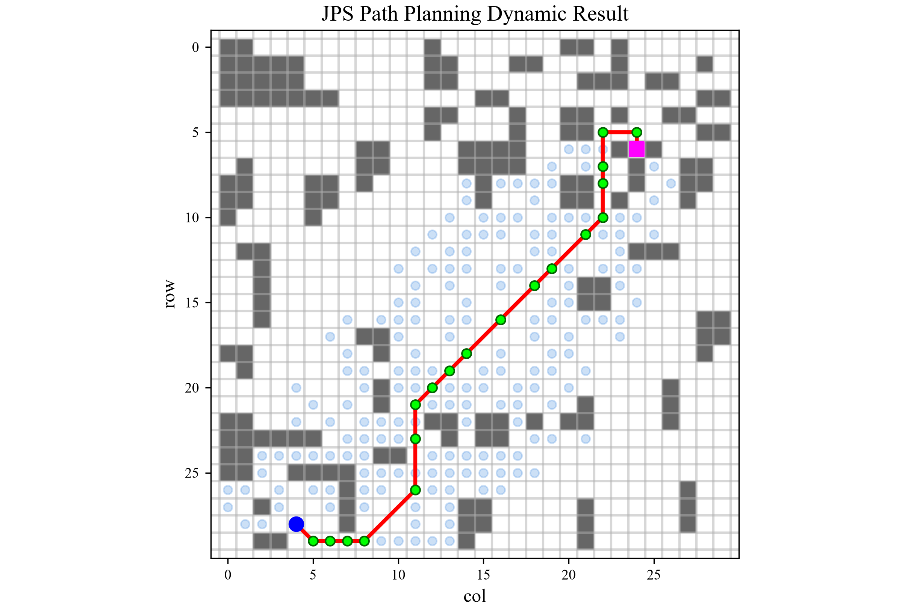
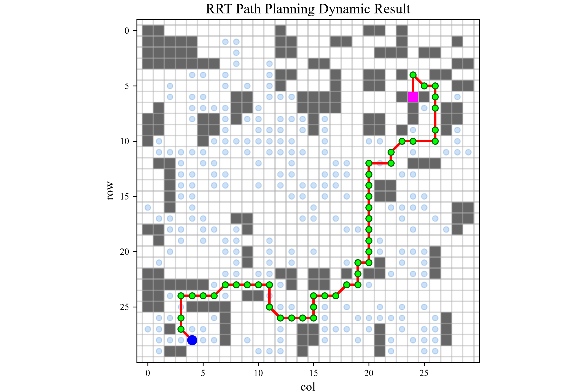
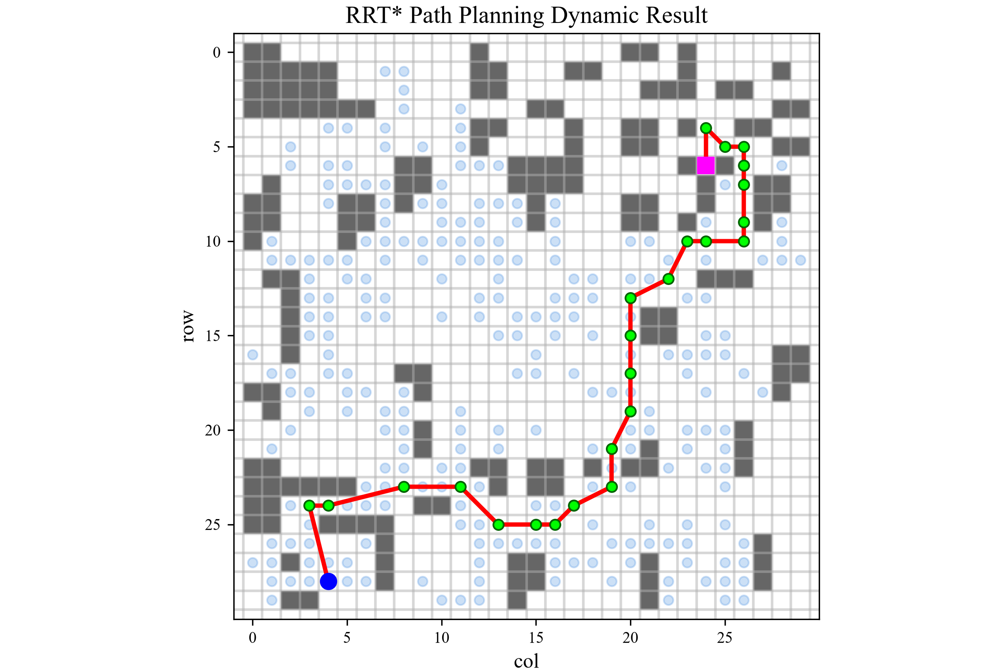
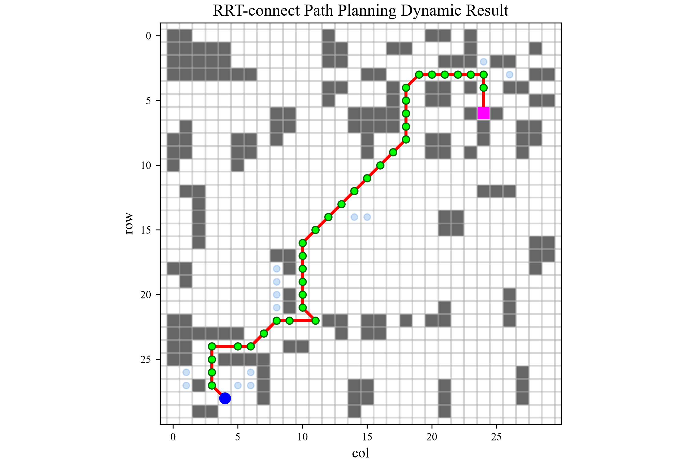

# grid-path-planning-algorithms

使用 Python 实现的栅格地图路径规划算法
（Dijkstra、A*、Bidirectional-A*、JPS、RRT、RRT*、RRT-connect）。

## 特点

- **严格禁止切角**：斜向移动要求两侧正交栅格均可通行。
- 地图数据存储于可编辑的 Excel 文件中，由 30×30 矩形区域表示。
- 起点和终点在 `grid_map_data.py` 中配置。
- 代码包含类型注解和详细注释，记录设计思路与逻辑推导过程。
- 基于 Matplotlib 的动态可视化：算法以生成器（Generator）逐次 yield 搜索状态用于绘图，最终路径通过`return`返回：动画通过`FuncAnimation`的`frames`参数接收迭代器，并在生成器到达路径时抛出`StopIteration`异常，由`try/except`机制捕获后在最终帧绘制完整路径。
---
### 白话
这个是关于栅格地图的路径规划算法，算法结构为节点的`class`，和 算法逻辑本身。
每次记录的节点内容是将节点坐标实例化后的节点对象，在状态输出，我使用了`yield`来输出每一步的探索状态，使用`matplotlib`中的`FuncAnimation`来绘制动态图， 使用`try/except`中的`except`捕捉由算法函数`return`返回的路径结果异常`StopIteration`。

我最开始学习的是`A*`算法 ，我使用`ai`生成了它的代码，开始学习，在我学习了它之后，我将启发式估计去掉，有了`Dijkstra`算法的代码。

后面我学习了`RRT`算法，这个算法我认为已经不属于邻域节点探索，而是邻域方向探索，在生成随机点以后，由随机点确定节点树`tree`中最近的节点，再由此节点向随机点方向移动一个步长，得到新节点。`RRT`算法的原逻辑对于是否到达终点的判断是，接近终点时，满足一定范围则连接，且原算法表明的是连续空间，我的地图结构是离散的栅格地图， 所以为了避免穿越障碍物，我在终点处设置了范围步长为2，以及斜向通行两侧无障碍物的约束。这个算法中有关于判断两点连线是否存在障碍物，我认为在离散空间中会有一种通用的方法。我的探索步长为2，也就是说我的探索范围半径为2，从某种程度上它的邻域范围是有限，所以，可以这么说，我将两点连线判断障碍物的问题减弱了。

后面我又继续学习了`RRT*`算法，这个算法是在`RRT`算法基础上引入了选父节点和重布线的概念，在得到新节点以后，会在节点树中选择符合新节点邻域范围内的节点，进行两个操作。第一个操作是如果经过某个节点到新节点代价最小，则把这个节点作为新节点的前导节点，即选择父节点。第二个操作是如果经过新节点到达的某个节点代价更小，则将新节点重新作为这个节点的前导节点，即重布线。

后面我又学习了`JPS`算法，是`A*`算法的改进版，它引入了跳点和强迫邻居的概念，原算法逻辑应用的图结构是栅格地图，但是它允许斜向任意通行，而我的斜向通行条件是两侧无障碍物，我按照原有算法对跳点和强迫邻居的定义，按照斜向通行条件对跳点和强迫邻居重新做了定义，具体的修改可以参见代码，也成功满足了斜向通行两侧无障碍物的要求。

后面我又学习了双向`A*`算法，它在`A*`算法基础上，增加了终点指向起点的探索路径。

之后我又学习了`RRT-connect`算法，它是`RRT`算法基础上，增加了终点指向起点的探索。但它在同时处理起点和终点的方法中与双向`A*`算法不同，双向`A*`是对每一次探索中起点和终点依次进行一个节点邻域的探索，而这个`RRT-connect`是，对主树`tree`（一个探索路径）进行邻域探索，对次树`tree`(另一个探索路径)进行`connect`连接，（这个连接方法又与`JPS`算法中的查找跳点的方法类似，沿着某一个固定方向进行步进不断探索，有一点`JPS`算法的味道在里面。），这样主树和次树的操作为一个循环，每次操作后，将主树和次数进行交换后，再进行下一个循环，直到连接成功。

---
<details>
<summary>English</summary>

# grid-path-planning-algorithms

Python implementation of grid-based pathfinding algorithms 
（Dijkstra、A*、Bidirectional-A*、JPS、RRT、RRT*、RRT-connect）。

## Features

- **Strict no-corner-cutting**: diagonal movement requires both orthogonal cells to be free.
- Map data is stored in an editable Excel file as a 30x30 grid.
- Source and target are configured in `grid_map_data.py`.
- Code includes type annotations and detailed comments documenting the design rationale.
- Matplotlib dynamic visualization: the algorithm yields search states step by step via a generator for drawing, and returns the final path through `return`. The animation receives the iterator via `FuncAnimation`'s `frames` parameter; when the generator reaches the path it raises `StopIteration`, which is caught by a `try/except` block to render the complete path on the final frame.

</details>

## 项目结构
```
grid-path-planning-algorithms/
├── algorithms_cpp/
│   ├── A_star.cpp
├── algorithms_py/
│   ├── Dijkstra.py
│   ├── A_star.py
│   ├── Bidirectional_A_star.py
│   ├── JPS.py
│   ├── RRT.py
│   ├── RRT_star.py
│   └── RRT_connect.py
├── utils/
│   ├── grid_map_data.py 
│   └── plt_dynamic.py
├── save_png/
│   ├── 动态绘图示例.gif
│   ├── map.png
│   ├── Dijkstra.png
│   ├── A_star.png
│   ├── Bidirectional_a_star.png
│   ├── JPS.png
│   ├── RRT.png
│   ├── RRT_star.png
│   └── RRT_connect.png
├── map.xlsx
├── requirements.txt
├── .gitignore
├── LICENSE
└── README.md
```
**Grid map**
<div align="center">

</div>

**动态绘图示例**
<div align="center">

</div>

**Dijkstra  Result**
<div align="center">

</div>

**A\*  Result**
<div align="center">

</div>

**Bidirectional-A\* Result**
<div align="center">

</div>

**JPS Result**
<div align="center">

</div>

**RRT Result**
<div align="center">

</div>

**RRT\* Result**
<div align="center">

</div>

**RRT-connect Result**
<div align="center">

</div>